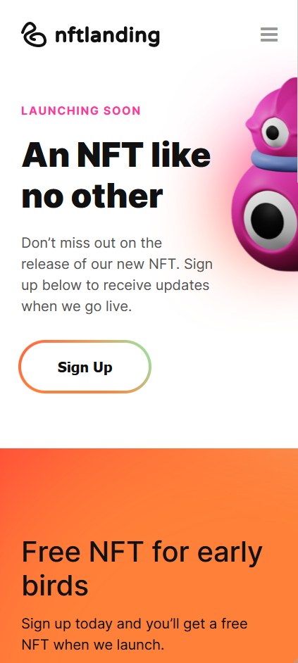
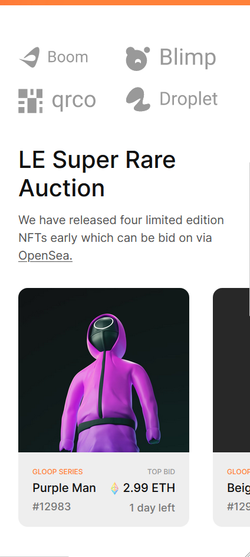
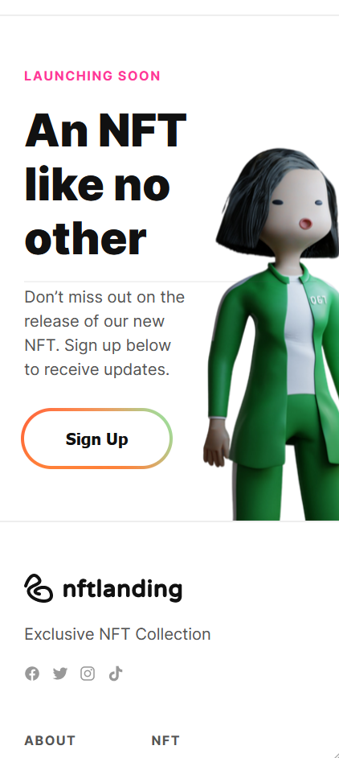
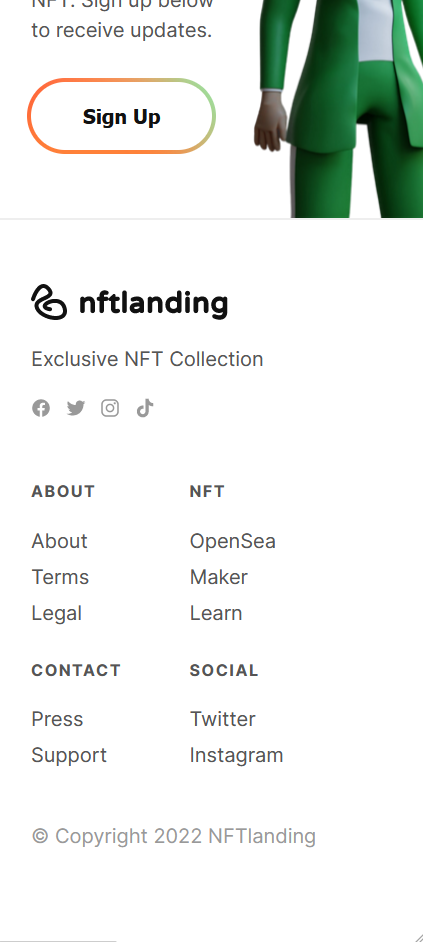
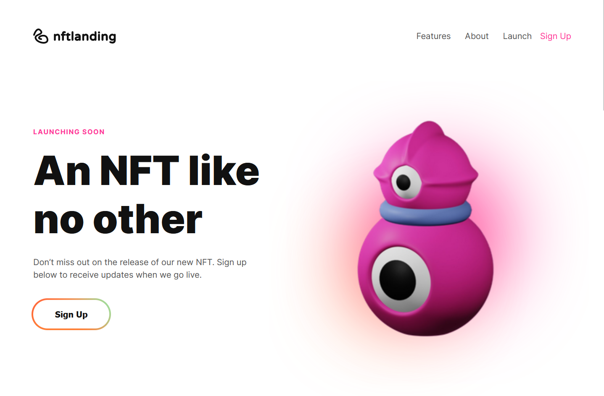
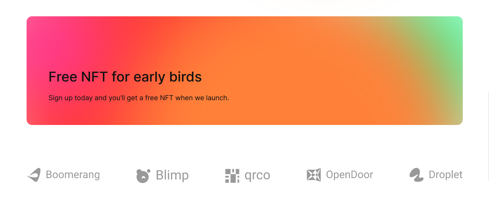
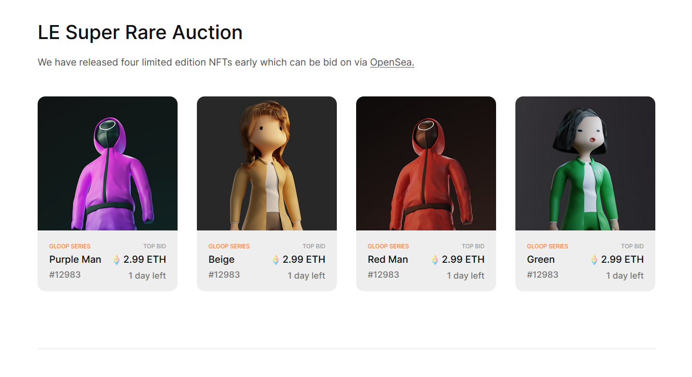
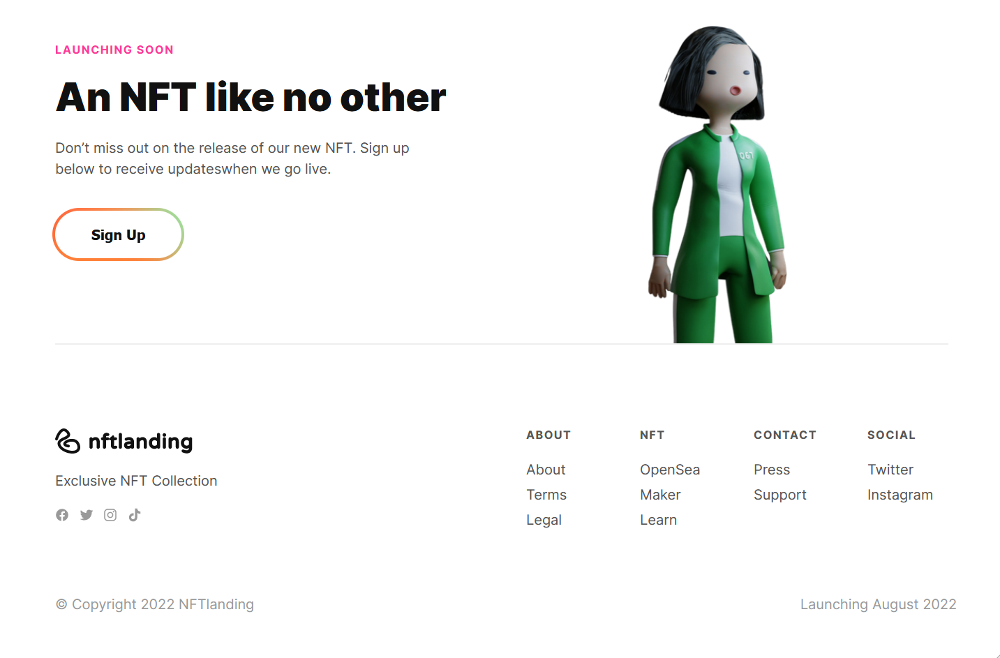

# CA - HTML/CSS Task

## Design
* Made with Figma
* NFT Startup Landing Page
* Responsive
    * Desktop width: 1440px;
    * Mobile width: 428px;

## Technologies Used
* HTML
* CSS

## Demo mobile
 

&nbsp; 
 
&nbsp; 
 

## Demo desktop
 

 

 

 

[:arrow_up_small: **Back To Top**](#top)
